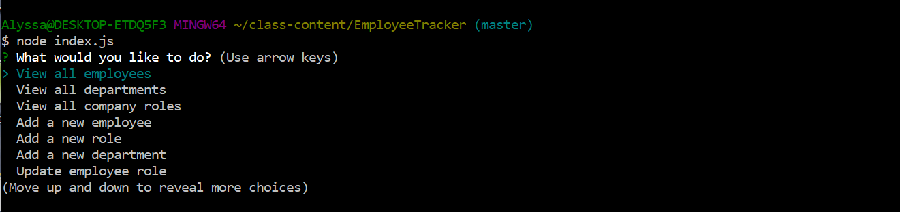
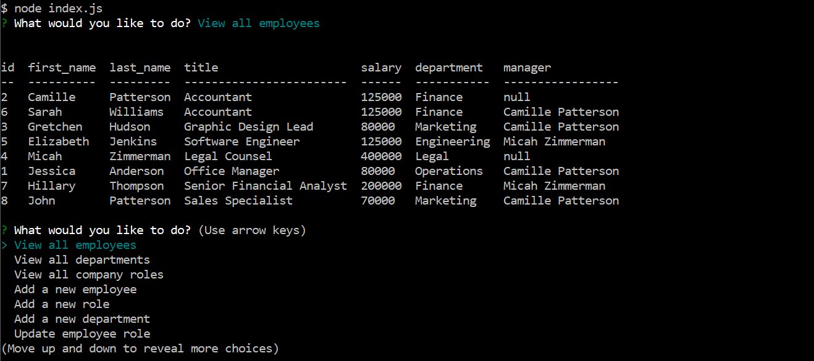

# EMPLOYEE TRACKER

## Description  
This is a command-line application that allows business owners to view and manage the departments, roles, and employees in their companies so they can better organize and plan their business.

## Table of Contents

* [Technologies Used](#technologies-used)

* [Dev Dependencies](#dev-dependencies)

* [How to Use](#how-to-use)

* [Demonstration Video](#demonstration-video)

* [How I Made This](#how-i-made-this)

* [GitHub Repo](#link-to-github-repo)

* [Future Development Ideas](#future-development-ideas)

## Technologies Used  
Built in Visual Studio with        
Javascript      
Node.js   
MySQL Workbench        

## Dev Dependencies  
inquirer  
mysql  
dotenv  
console.table           

## How to Use  
Install dependencies using npm install.  
Go to .env.sample.txt to see where to enter your MySQL password. Create your own .env file with your password in it just as it is in the sample.    

Run the program by typing "node index.js" in the command line.      
   

A list of options will appear. Navigate to an option using the up and down arrow keys and press enter to select that option. The options are:       
  --View all employees   
  --View all departments     
  --View all company roles  
  --Add a new employee    
  --Add a new role  
  --Add a new department  
  --Update employee role  
  --Exit   

Upon making a selection, the user will either be presented with the information they seek (for example, selecting "View all employees" will result in the user being presented with a table that includes all employees and their roles, salaries, departments, and managers) or they will be prompted to answer a few questions in order to add or update something in the database.    

View all employees:
   

Add a new department:  
    

After viewing information or completing an adjustment to the database, the user will be able to choose another option from the initial menu. They will continue to be taken back that menu every time they complete a task until they select "exit", at which point the program will end.

## Demonstration Video
(https://drive.google.com/file/d/1mbAAx1HZkXu1bNlXz54mVaGqHs7MYukf/view)  

## How I Made This    
The first thing I did was create a package.json and install my dependencies. Then I created all of the files I would need.

From there I created a schema.sql and copied that into MySQL Workbench. I also created a seed file and added some department, role, and employee data to my tables in both the file and on mySQL Workbench.  

From there I created my index.js file, which begins with a connection to MySQL. After that I used Inquirer to establish the options the user would see when they ran the program, then a switch statement that handles the user's choice(s). After the switch statement is a long list of functions that make it possible to display from, update, and add to database information.  

The connection ends when the user chooses "exit" from the list of options. 

## Link to GitHub Repo    
(https://github.com/alyssahellrung/EmployeeTracker)

## Future Development Ideas
This project was very simple in some ways and completely beyond me in others. I have several things I still want to do:
1) Instead of having to add an id number for managers when adding an employee, I want to give the user a list of manager names to choose from.
2) I want to add the option to delete things from the database.
3) I would like to be able to display information in ways I did not manage to yet--for example, display all of the employees in a chosen department.
4) I want to turn this whole thing into a team tracker for sports teams. 